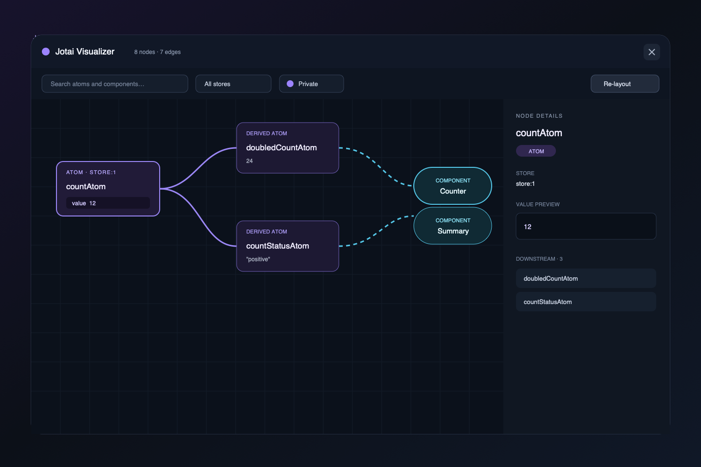

# M3 Embedded Visualizer

M3는 `RuntimeGraph` snapshot을 애플리케이션 내부 floating panel로 탐색할 수 있는
첫 graph UI다.



## 실행

```sh
pnpm dev
```

브라우저에서 터미널에 표시된 Vite URL을 열면 Visualizer가 열린 상태로 표시된다.
테스트 앱에는 default Store와 custom Store가 함께 있으며 각각의 Counter를
독립적으로 변경할 수 있다.

## 현재 수동 통합

M4 자동 계측 전에는 tracked hook과 Collector를 사용한다.

```tsx
import {
  JotaiGraphCollector,
  JotaiVisualizer,
  RuntimeGraphProvider,
  createRuntimeGraph,
} from '@jotai-visualizer/react'

const runtime = createRuntimeGraph({
  valuePreview: {
    enabled: true,
    redact: (_value, { atomLabel }) =>
      /password|secret|token/i.test(atomLabel),
  },
})

createRoot(root).render(
  <RuntimeGraphProvider runtime={runtime}>
    <JotaiGraphCollector />
    <Application />
    <JotaiVisualizer />
  </RuntimeGraphProvider>,
)
```

`JotaiGraphCollector`는 private atom도 runtime에 수집한다. Visualizer에서는
기본적으로 숨기며 사용자가 `Private atoms` toggle을 켰을 때만 canvas와 detail에
표시한다.

## UI 기능

- bottom-right floating trigger와 panel
- primitive/derived atom 및 component custom node
- solid dependency edge와 dashed consumer edge
- read/write/read-write edge label
- atom/component 검색과 one-hop context
- Store 단위 filter
- private atom toggle
- node value/source/revision detail
- upstream/downstream 목록과 관련 경로 강조
- atom revision 변경 animation
- Dagre left-to-right layout
- node drag 위치 보존과 수동 re-layout
- zoom, pan, minimap, fit view

## 접근성

- dialog, graph, detail에 명시적인 accessible name 제공
- 검색, Store select, private toggle에 label 제공
- graph node는 keyboard focus 가능
- `Escape`로 panel 닫기
- 닫은 뒤 floating trigger로 focus 복귀
- reduced-motion 환경에서 animation 최소화

## 성능과 수명주기

panel이 닫혀 있으면 graph content를 mount하지 않으며 RuntimeGraph subscription도
만들지 않는다. 값 revision만 변경될 때 Dagre를 다시 실행하지 않고 기존 layout을
재사용한다. topology 변경과 명시적인 re-layout에서만 배치를 다시 계산한다.

100-node chain model은 test 환경에서 모든 좌표를 계산하고 saved position을
보존하는 것을 검증한다. 500-node 실제 browser benchmark는 M5 범위다.

## CSS 경계

Visualizer custom selector는 `.jv-` prefix 아래에 있고 host의 `body`, `button`,
`input` 같은 element selector를 변경하지 않는다. React Flow 기본 stylesheet는
Visualizer 내부의 React Flow class에만 적용된다.

## Visual QA

- reference: `docs/references/m3-visualizer-reference.png`
- viewport: 1440×960
- final visual-verdict: **93 / pass**
- Chrome console warning/error: 없음

visual-verdict iteration 기록은 `.omx/state/m3/ralph-progress.json`에 보존된다.

## 알려진 제한

- component metadata는 수동 tracked hook에서 제공한다.
- 여러 Store를 동시에 표시하면 single-Store view보다 node가 작아질 수 있다.
- Store 이름은 현재 `store:1` 형태의 runtime ID다.
- UI package build가 배포용 CSS asset을 복사하는 과정은 M6에서 확정한다.
- browser extension, time travel, state editing은 지원하지 않는다.
